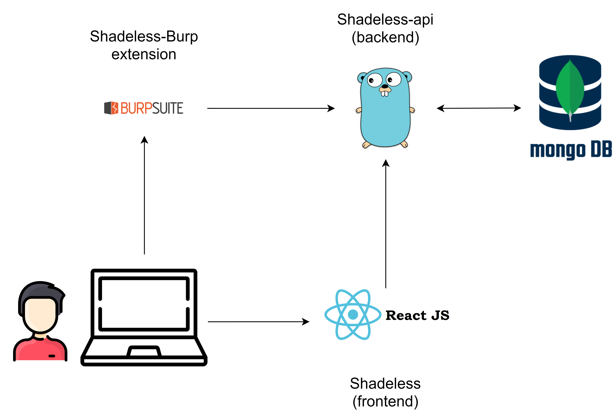

# Shadeless

-	Shadeless is a set of tools for easier web hacking by logging web traffic, endpoints discovery, domains enumeration

Burp extension for shadeless: https://github.com/phvietan/shadeless-burp
API Shadeless: https://github.com/phvietan/shadeless-api

# How it works:

- Illustration:

Burp extension of shadeless will transfer logs to Shadeless API server.

This repo is the frontend, frontend will communicate with API server to show UI for easy hacking

- 1: Install Shadeless-burp to your Burp
- 2: Run Shadeless-api
- 3: Run Shadeless

# Steps to use:

- Run this project: `npm start`
- Install burp extension on https://github.com/phvietan/shadeless-burp
- Run the API Shadeless

# Todo:

- Feature scan with Jaeles
- Chia bảng dashboard theo path + params + status code
- Thêm cột dashboard đã fuzzed
